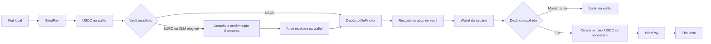

# PigFi — PRD de expansão multi-vault SCF45

**Versão:** 1.0 · **Data:** 25/09/2026 · **Status:** especificação para execução e revisão de produto.

**Contexto:** SCF45 já conquistado, conforme informado pela responsável pelo produto. Este documento organiza a entrega. Backend `smartpig-backend` e aplicativo `SmartPig_Stellar-37o` estão na branch `game`. O código local anteriormente produzido permanece sem commit nesta entrega. A elaboração deste PRD acrescenta somente documentação.

## 1. Resultado esperado e decisões de produto

O PigFi oferecerá três vaults separados, cada um com um ativo: USDC, EURC e XLM. A experiência começa em USDC e permite avançar conforme o usuário aprende. Não haverá alocação automática entre os três vaults nem conversão de saldo sem confirmação.

| Vault | Papel no produto | Acesso educacional | Origem do rendimento candidata |
|---|---|---|---|
| USDC | Entrada para iniciantes; preservar o vault existente | Liberado desde o início, sem pontos | Preservar a configuração existente; conferir o contrato em operação |
| EURC | Diversificação cambial em stablecoin de euro | Nível intermediário, por pontos | DeFindex Blend Autocompound EURC |
| XLM | Exposição avançada a ativo volátil | Nível avançado, por pontos | DeFindex Blend Autocompound XLM |

**Decisões fornecidas pela responsável pelo produto:** três ativos; USDC inicialmente livre; EURC intermediário; XLM avançado; cards informativos seguidos de perguntas de múltipla escolha; pontos persistidos no backend; BlindPay restrita ao on/off-ramp da wallet. Soroswap será o caminho de integração especificado para conversões, sujeito à validação operacional das rotas.

**Parâmetros propostos, ainda não ratificados como decisão comercial:** 10 pontos por pergunta, EURC a partir de 90 e XLM a partir de 150. Esses valores já estão na implementação local e são configuráveis. O requisito aprovado é a progressão por pontos, não esses números específicos.

A composição é tecnicamente plausível com estratégias publicadas para os três ativos e um adapter comum. O lançamento de EURC e XLM ainda depende de criar e validar os vaults, integrar swaps, completar interfaces por ativo e demonstrar depósitos e saques reais. O rendimento XLM observado é muito baixo: seu posicionamento deve enfatizar exposição ao ativo e aprendizado, sem prometer rentabilidade relevante.

## 2. Escopo e limites

Inclui catálogo multi-vault; elegibilidade no backend; educação; saldos por ativo; swaps; depósitos; resgates; configuração operacional; criação dos dois novos vaults; monitoramento; recuperação de falhas; validação móvel e evidências da tranche.

Não inclui um contrato novo de estratégia, alavancagem, carteira administrada, rebalanceamento entre vaults, ponte entre redes, custódia de chaves pelo PigFi ou migração automática do USDC existente. A expansão geográfica do ramp e Etherfuse seguem seus próprios trabalhos do SCF; este PRD preserva a compatibilidade com eles.

O desbloqueio permite **novos depósitos**. Nunca será pré-requisito para consultar uma posição, resgatar ou recuperar fundos. Bloqueios técnicos reais do protocolo devem ser explicados separadamente.

## 3. Jornadas e responsabilidades

Quem já possui o ativo correto na wallet pode depositar diretamente. Quem resgata pode manter o ativo, sem swap ou off-ramp obrigatório. O PigFi apresenta e coordena a jornada; o usuário autoriza as transações; Soroswap converte; DeFindex aplica/resgata; Blend sustenta a estratégia; BlindPay converte entre fiat e o ativo suportado no ramp.

### 3.1 Primeiro depósito em USDC

Usuário autenticado vê USDC disponível mesmo com zero pontos. Escolhe um valor, visualiza saldo utilizável, custos e condições, assina e acompanha a confirmação. Recursos de educação continuam opcionais para entrar nesse vault.

### 3.2 Aprender e desbloquear

Usuário vê EURC/XLM com nível e pontos restantes. Abre uma lição, lê cards, responde perguntas, recebe explicação e pontos por acertos inéditos. Pode tentar novamente após erro. Atingido o limite configurado e cumprida a sequência de aprendizado, o backend atualiza a elegibilidade; o aplicativo atualiza o catálogo sem exigir novo login.

### 3.3 Depositar EURC ou XLM

O sistema verifica elegibilidade e disponibilidade antes de propor qualquer compra. Com saldo insuficiente do ativo e USDC disponível, oferece cotação de conversão. Exibe entrada, saída estimada, mínimo recebido, custos, validade e impacto de preço. Após consentimento e confirmação do swap, recalcula o saldo e prepara o depósito. A primeira versão utiliza transações separadas; não promete atomicidade entre swap e depósito.

### 3.4 Resgatar e voltar a fiat

Usuário escolhe quantidade ou resgate total, vê estimativa no ativo correto e confirma. Depois da confirmação on-chain, pode manter o saldo ou convertê-lo para USDC. Só após USDC disponível inicia o off-ramp. Resgate, swap e payout têm estados e comprovantes próprios.

## 4. Educação e pontos

| ID | Requisito e critério verificável |
|---|---|
| EDU-01 | Conteúdo com cards informativos antes de perguntas de múltipla escolha; respostas corretas não são enviadas no catálogo público de lições. |
| EDU-02 | Backend calcula e persiste pontos por usuário autenticado; não aceita pontuação declarada pelo cliente. |
| EDU-03 | Acerto concede pontos uma única vez por pergunta; erro concede zero; repetição e concorrência não duplicam recompensa. |
| EDU-04 | Progresso permanece após logout, reinstalação e uso em outro dispositivo com a mesma identidade. |
| EDU-05 | USDC exige zero pontos. Limites de EURC/XLM são configuração validada, sendo XLM superior a EURC e alcançável pelo conteúdo disponível. |
| EDU-06 | A sequência garante contato com conteúdo de volatilidade, liquidez e saída antes do acesso a XLM. Não basta acumular pontos em perguntas triviais repetidas. |
| EDU-07 | Alteração de conteúdo preserva o histórico. Versionamento não permite ganhar novamente pela mesma pergunta apenas por troca editorial. |
| EDU-08 | Mudanças de limite afetam elegibilidade para novas aplicações; posições existentes e saques permanecem acessíveis. |
| EDU-09 | Explicar requisitos de acesso, pontos obtidos e próximos passos em linguagem simples. Nenhum depósito, saldo ou compra é exigido para ganhar pontos. |

A base local contém cinco lições sequenciais: fundamentos; wallet/ramp/vault; diversificação dólar/euro; volatilidade de XLM; liquidez e saída. São dois cards e três perguntas por lição, totalizando 150 pontos possíveis na configuração atual.

Além dos pontos, registrar ciência dos riscos específicos, com versão do texto e data, antes do primeiro depósito elegível. Esse registro complementa a educação e a referência arquitetural do SCF, mas ainda não foi implementado. Não deve bloquear saques.

O histórico antigo de XP no armazenamento local não é evidência confiável para crédito financeiro de acesso. Antes da publicação, definir e comunicar a transição: reaprendizado curto ou migração apenas de histórico verificável. Não converter automaticamente números enviados pelo dispositivo em pontos confiáveis.

## 5. Catálogo e configuração multi-vault

| ID | Requisito e critério verificável |
|---|---|
| CAT-01 | Um registry identifica explicitamente rede, vault, ativo e estratégia. Símbolo sozinho nunca identifica um ativo. |
| CAT-02 | Manter o endereço do vault USDC atual. EURC e XLM entram como registros independentes, utilizando o adapter DeFindex comum. |
| CAT-03 | Resposta inclui acesso calculado pelo backend, pontos necessários/restantes e possibilidade de depositar. Cliente usa esses dados para renderização. |
| CAT-04 | Separar visibilidade, habilitação de depósito e estado operacional. Pausar captação não oculta posição nem desabilita resgate por regra de produto. |
| CAT-05 | Ativo desconhecido e contrato fora da lista permitida falham de forma restritiva para depósitos. |
| CAT-06 | Sincronização não reativa uma configuração pausada. Contrato recém-descoberto não é publicado automaticamente como opção de investimento. |
| CAT-07 | Revalidar política ao preparar e ao submeter depósito. Se a política mudou depois da cotação, explicar e preservar o saldo na wallet. |

Manifesto de configuração proposto, a ser implementado/mapeado aos modelos existentes:

| Grupo | Campos necessários |
|---|---|
| Identidade | `id`, `network`, `vaultContractId`, `assetContractId`, `assetCode`, `issuer` quando aplicável, `decimals` |
| Estratégia | `strategyContractId`, `protocol`, `poolContractId`, versão/hash verificados |
| Produto | nome, nível, riscos, `requiredPoints`, versão do reconhecimento de riscos |
| Operação | `visible`, `depositsEnabled`, motivo de pausa, limites operacionais, versão da configuração |
| Conversão | pares e provedores permitidos, limites de slippage/impacto, validade da cotação |
| Evidência | transação de criação, ledger, ambiente, responsável, data de validação |

Os campos acima são o contrato-alvo de produto, não uma declaração de que já existem no schema. A configuração deve ser auditável e somente operadores autorizados podem alterá-la. Pausas urgentes podem bloquear novas aplicações sem alterar os contratos ou a propriedade das cotas.

## 6. Swaps com Soroswap

**Decisão técnica:** integrar o serviço de cotação e construção de transações Soroswap. Sua API documenta entrada/saída por ativo, montante, rede e tolerância de preço, permitindo implementar o fluxo necessário. A disponibilidade de cada rota precisa ser demonstrada por cotação autenticada e execução controlada; não foi testada nesta entrega.

O fluxo documentado é cotação, construção de XDR, assinatura do usuário e envio. A credencial fica exclusivamente no backend. O agregador pode encontrar caminhos por Soroswap, Phoenix e Aqua; os protocolos permitidos devem ser explícitos na configuração. Referências: [quickstart Soroswap](https://docs.soroswap.finance/api/quickstart) e [documentação da API](https://api.soroswap.finance/docs).

| ID | Requisito e critério verificável |
|---|---|
| SWP-01 | Suportar USDC → EURC, EURC → USDC, USDC → XLM e XLM → USDC. Conversão direta EURC ↔ XLM não é necessária à primeira entrega. |
| SWP-02 | Cotar para rede, ativos e quantidade reais; não inferir liquidez de swap a partir do saldo Blend. |
| SWP-03 | Exibir cotação, mínimo recebido, taxas estimadas, impacto e expiração; exigir nova confirmação se condições relevantes mudarem. |
| SWP-04 | Definir slippage e impacto máximos por configuração após medir as rotas. Nunca aumentar tolerância silenciosamente para forçar execução. |
| SWP-05 | Validar XDR e autorizações: rede, conta, destinatário, contratos permitidos, ativos, quantidades, limites e taxas. Wallet do usuário é a origem/destino previstos. |
| SWP-06 | Simular antes de assinar; integrar assinatura Privy; verificar separadamente patrocínio de taxas Soroban. Não presumir que o fee-bump clássico existente cubra todos os casos. |
| SWP-07 | Persistir intenção, cotação, expiração, hash, estado e montantes efetivos; reconciliar timeout antes de permitir reenvio. |
| SWP-08 | Confirmar recebimento antes de preparar depósito ou payout. Se o depósito falhar após swap confirmado, oferecer repetir somente o depósito ou manter o saldo. |
| SWP-09 | Sem rota, cotação expirada ou liquidez insuficiente: não executar compra; oferecer atualizar ou voltar, sem promessa de taxa fixa. |
| SWP-10 | Desabilitar novos swaps por configuração sem bloquear resgate do ativo para a wallet. |

Cotação e transação devem usar valores atômicos inteiros representados como strings. Definir política de arredondamento por direção, sem `parseFloat` para valores financeiros. As duas confirmações da primeira versão precisam estar claras na interface: converter e aplicar são operações distintas, mesmo apresentadas na mesma jornada.

## 7. Depósitos, saques e particularidades dos ativos

| ID | Requisito e critério verificável |
|---|---|
| TX-01 | Adapter resolve o ativo pelo registry; consulta saldo correto e monta depósito para o vault correspondente. |
| TX-02 | Validar propriedade da intenção e identidade no backend em preparo, assinatura/submissão e consulta. |
| TX-03 | Exibir quantidades em USDC, EURC ou XLM; equivalente fiat é secundário e contém moeda, fonte e horário. |
| TX-04 | Diferenciar unidades do ativo de cotas/dfTokens. Conversão para resgate usa estado atual, precisão e regras de arredondamento corretos. |
| TX-05 | Permitir resgate parcial/total e leitura de saldo em vault pausado, sem gate educacional. Simular a operação real e tratar falha de liquidez. |
| TX-06 | Não marcar sucesso com endereço previsto, resposta HTTP ou envio apenas. Confirmar resultado on-chain e atualizar posição após reconciliação. |
| TX-07 | Modelar saldo em wallet, posição no vault e valor fiat separadamente; não somar quantidades de ativos diferentes. |
| TX-08 | Reconciliar posições a partir de dados on-chain, inclusive cotas recebidas por transferência; histórico de depósitos do PigFi não é a única prova de posição. |

**XLM:** ativo nativo, sem issuer nem trustline. A integração Soroban utiliza seu Stellar Asset Contract; isso não exige uma etapa comercial de wrapping. O saldo investível deve descontar reserva mínima, liabilities e taxas previstas, considerando sponsorship. A opção “máximo” não pode consumir recursos necessários para manter a conta e concluir operações. [Fundamentos de XLM](https://developers.stellar.org/docs/learn/fundamentals/lumens#minimum-balance).

**USDC e EURC:** validar código e issuer oficiais e sua correspondência ao SAC. Preparar trustline e autorização quando necessárias para receber tokens na conta clássica. A experiência deve explicar eventual transação adicional antes do swap ou resgate. Os ativos listados usam sete casas decimais na Stellar. A unidade interna de um provedor de ramp pode ser diferente: converter explicitamente na fronteira da integração.

A fonte atual de rendimento candidata é Blend Autocompound: juros do mercado de empréstimos e recompensas BLND, convertidas e reinvestidas pela estratégia. O swap interno de recompensas não implementa o swap da wallet do usuário. A colheita/reaplicação depende da operação da estratégia. [Estratégia DeFindex](https://docs.defindex.io/strategies/blend-autocompound).

O saque depende de liquidez não emprestada, posição e condições do protocolo e do vault. A fila de 17 dias do backstop Blend não deve ser atribuída automaticamente a esta estratégia de lending. Não prometer saque instantâneo garantido nem inventar carência fixa. Referências: [lending](https://docs.blend.capital/users/lending-borrowing/lending), [backstop](https://docs.blend.capital/users/backstopping).

## 8. Criar os vaults EURC e XLM

Existe uma base de administração/criação no backend, mas os dois novos vaults **não foram criados**. Cada vault deve receber um único ativo e sua estratégia correspondente. Não há necessidade identificada de desenvolver uma estratégia própria para esta entrega.

Procedimento de entrega:

1. Resolver e registrar o endereço USDC existente sem recriá-lo. Conferir ambiente, estratégia, fees e papéis atuais.
2. Verificar factory, SAC, estratégia, pool, código implantado e compatibilidade com a versão utilizada do adapter/API. Registrar evidência e data no manifesto.
3. Definir nome/símbolo das cotas, performance fee, manager, rebalance manager, emergency manager, fee receiver e política de atualização. Evitar adotar defaults do SDK como decisão de governança.
4. Validar autorização administrativa efetiva, conta operadora, chaves e política de assinatura. Definir multisig ou controle equivalente para funções críticas.
5. Preparar e simular criação. Determinar seed, reservas, taxas e autorizações exigidos pelo contrato/API. Aprovar esses valores no procedimento operacional antes de usar fundos.
6. Assinar e submeter. Persistir intenção, hash e estado pendente. Timeout resulta em reconciliação, não em criação duplicada.
7. Confirmar sucesso e endereço real pelo resultado on-chain. Verificar ativo, estratégia e papéis no contrato criado.
8. Cadastrar com depósitos desabilitados; executar depósito/resgate controlados, conferir cotas, taxas e recuperação; só então habilitar para o grupo elegível.

**Correções obrigatórias na base administrativa antes da criação:** o fluxo local de submissão pode publicar endereço previsto no catálogo antes de validar `success`; deve publicar somente contrato confirmado e verificado. Falha de transporte deve distinguir resultado desconhecido de falha final. A autorização administrativa deve exigir papel operacional real, não apenas token de usuário válido.

Estados propostos: `DRAFT → PENDING_SIGNATURE → SUBMITTED → CONFIRMED → VERIFIED → ENABLED`, com `FAILED` para falha comprovada e estado de reconciliação para resultado desconhecido. Criação confirmada e habilitação comercial são eventos diferentes.

O manager controla funções relevantes e, quando permitido, atualizações; o emergency manager pode pausar/resgatar estratégias para idle. Esses poderes devem aparecer na avaliação de risco e no runbook. A pausa da estratégia não equivale a bloquear saída na interface. [Papéis DeFindex](https://docs.defindex.io/integration-guide/vault-roles).

**Fees:** a documentação atual descreve performance fees sobre rendimento, não uma cobrança anual sobre TVL. Conferir semântica de `vaultFeeBps`, parcela do protocolo e informação apresentada ao usuário. Corrigir materiais que confundam essas bases. APY da estratégia não deve ser rotulado automaticamente como APY líquido do vault PigFi. [Fees DeFindex](https://docs.defindex.io/intro/fees).

## 9. Contratos candidatos e manifesto de mainnet

Referências consultadas em 25/09/2026: [deployments DeFindex](https://docs.defindex.io/contract-deployments/index), [contratos atuais](https://github.com/defindex-io/stellar-contracts) e [API de estratégias](https://www.defindex.io/api/strategies). Estes são contratos candidatos publicados; não são os endereços dos novos vaults PigFi.

| Componente | Endereço |
|---|---|
| Factory DeFindex | `CDKFHFJIET3A73A2YN4KV7NSV32S6YGQMUFH3DNJXLBWL4SKEGVRNFKI` |
| Pool Blend comum às estratégias consultadas | `CAJJZSGMMM3PD7N33TAPHGBUGTB43OC73HVIK2L2G6BNGGGYOSSYBXBD` |
| USDC SAC | `CCW67TSZV3SSS2HXMBQ5JFGCKJNXKZM7UQUWUZPUTHXSTZLEO7SJMI75` |
| EURC SAC | `CDTKPWPLOURQA2SGTKTUQOWRCBZEORB4BWBOMJ3D3ZTQQSGE5F6JBQLV` |
| XLM SAC nativo | `CAS3J7GYLGXMF6TDJBBYYSE3HQ6BBSMLNUQ34T6TZMYMW2EVH34XOWMA` |
| Estratégia USDC consultada | `CDB2WMKQQNVZMEBY7Q7GZ5C7E7IAFSNMZ7GGVD6WKTCEWK7XOIAVZSAP` |
| Estratégia EURC consultada | `CC5CE6MWISDXT3MLNQ7R3FVILFVFEIH3COWGH45GJKL6BD2ZHF7F7JVI` |
| Estratégia XLM consultada | `CDPWNUW7UMCSVO36VAJSQHQECISPJLCVPDASKHRC5SEROAAZDUQ5DG2Z` |

O manifesto final deve acrescentar os issuers clássicos de USDC/EURC, endereços reais dos vaults PigFi, contratos/rotas Soroswap permitidos, versões, hashes e transações de criação. Não copiar configuração entre testnet e mainnet. O nome “Fixed” do pool não representa rendimento fixo.

## 10. Liquidez consultada e limites da evidência

Consulta direta à DeFindex e leitura RPC realizada em **25/09/2026 às 14:31:26 UTC / 11:31:26 Brasília**. Ledger da leitura RPC: **64612207**. Valores expressos no próprio ativo, sem conversão para dólares.

| Ativo | TVL da estratégia | Saldo do ativo no pool Blend | APY anualizado de 7 dias informado pela API |
|---|---:|---:|---:|
| USDC | 20.174.092,4512792 | 10.349.077,1406918 | 8,44884794% |
| EURC | 61.475,3213706 | 147.531,6427274 | 0,15029968% |
| XLM | 48.495,1160956 | 698.595.137,2449912 | 0,00006815% |

O saldo foi observado por simulação de `SAC.balance(pool)`, sem assinatura/envio. É caixa compartilhado do pool; não é limite garantido de retirada da estratégia ou do futuro vault. A API não fornece timestamp do indexador, portanto seus números não devem ser atribuídos ao mesmo ledger da leitura RPC. Não houve execução de resgate para provar capacidade efetiva.

A validação operacional precisa combinar: estado da estratégia; posição do vault; liquidez livre do protocolo; simulação do resgate solicitado; limites aplicáveis; e, separadamente, cotação de swap. Snapshot antigo serve como evidência de pesquisa, nunca como cotação ou promessa ao usuário.

Implementar monitoramento com horário da leitura, degradação de RPC/indexador, erro de simulação e motivo de indisponibilidade. Antes de ativar cada vault, repetir as leituras e testar valores representativos da faixa de depósito prevista. Registrar liquidez e custo de saída no runbook, sem apresentar TVL como dinheiro disponível para saque.

Evidência local: [relatório da pesquisa](../research/multivault-2026-09-25.md) e [snapshot estruturado](../research/multivault-liquidity-2026-09-25.json).

## 11. BlindPay e fronteira com o ramp

Não é correto afirmar que a plataforma BlindPay só trabalha com USDC: material oficial consultado menciona USDC e USDT. Isso não comprova disponibilidade de ambos em toda rede, país ou rail. EUR em transferência bancária também não significa suporte a EURC. [Comparação oficial BlindPay](https://blindpay.com/compare/circle).

Para o PigFi, a referência de integração continua sendo USDC em produção e o token de desenvolvimento configurado no ambiente de testes. Não há confirmação operacional de on/off-ramp direto em EURC ou XLM nesta pesquisa.

Requisitos:

- Confirmar com a configuração/API contratada os países, rails, redes e tokens efetivamente habilitados.
- Preservar o fluxo fiat → BlindPay → wallet; só depois escolher/aplicar no vault.
- Na saída, não abrir payout antes da confirmação de USDC disponível.
- Separar falhas de resgate, swap e payout; cada etapa conserva seu próprio identificador e reconciliação.
- Reutilizar a abstração de ramp prevista no SCF, permitindo evolução de cobertura sem acoplar educação ou registry à BlindPay.

## 12. O que já foi feito na branch game

Esta seção descreve alterações locais existentes antes da redação deste PRD. “Implementado localmente” não significa publicado, migrado em produção ou validado com fundos reais.

| Entrega local | Situação e limite |
|---|---|
| Catálogo de cinco lições, cards e perguntas | Implementado; revisão pedagógica e tradução ainda necessárias |
| API de lições, progresso e respostas | Implementada com avaliação no servidor e identidade autenticada |
| Modelo `LearningReward` e migração | Criados; unicidade usuário/pergunta e pontos persistentes; não aplicada em produção |
| Antiduplicação concorrente | Implementada com inserção que ignora conflito; validada em PostgreSQL local |
| Elegibilidade EURC/XLM | Implementada com limites configuráveis 90/150; USDC zero |
| Gate de depósitos | Aplicado no backend no preparo/submissão; allowlist e bloqueio operacional |
| Pausa e saída | Sync preserva inatividade existente; resgates/saldo não exigem vault ativo |
| Interface educacional e estado de acesso | Integrados ao app; cache por usuário; cards de vault com progresso |
| Pesquisa DeFindex/Soroswap/liquidez | Documentada; script de leitura e snapshot criados |

### 12.1 Inventário de arquivos

Backend: alterações em `.env.example`, `prisma/schema.prisma`, `src/app.module.ts`, `src/config/env.schema.ts`; controllers, módulos, serviços e testes de depósitos; `src/jobs/vault-sync.job.ts`; controller/módulo/serviço de vaults; serviço e testes de withdrawals.

Novos arquivos backend: `src/learning/learning.catalog.ts`, `learning.controller.ts`, `learning.controller.spec.ts`, `learning.module.ts`, `learning.service.ts`, `learning.service.spec.ts`; `src/jobs/vault-sync.job.spec.ts`; `prisma/migrations/20260925143000_learning_rewards/migration.sql`; `docs/modules/learning.md`; os dois arquivos de pesquisa vinculados acima; `scripts/check-multivault-liquidity.cjs` e `scripts/test-learning-postgres.cjs`.

App: alterações em `app/(tabs)/learn.tsx`, `app/(tabs)/vaults.tsx`, `app/education.tsx`, `app/vault/[id].tsx`, `lib/api/vaults.ts` e `lib/queries/vaults.queries.ts`. Novos: `components/ui/LearningLessonPlayer.tsx`, `lib/api/learning.ts`, `lib/queries/learning.queries.ts`.

Detalhamento da base educacional: [documentação do módulo](../modules/learning.md).

### 12.2 Verificações já executadas

- Build do backend aprovado; 18 suites e 106 testes aprovados.
- TypeScript do app sem erros; lint dos arquivos trabalhados sem erros, com seis warnings.
- PostgreSQL 16 local descartável: 19 migrações aplicadas; vinte respostas corretas simultâneas para a mesma pergunta concederam pontos uma vez; progresso de 150 pontos persistiu entre instâncias do serviço.
- Dependências instaladas e Prisma gerado localmente. Container de teste encerrado/removido; imagem PostgreSQL permanece no ambiente local.

Não houve commit, push, deploy, migração de produção, criação dos novos vaults, swap, assinatura ou envio financeiro. Não houve validação em dispositivo nem jornada mainnet completa. Essas verificações anteriores não foram repetidas por causa desta edição exclusivamente documental.

### 12.3 Lacunas concretas

`DepositModal` ainda consulta saldo USDC e usa conversão numérica/representação monetária específicas. `WithdrawModal` ainda usa representação em dólar. A carteira consolidada precisa distinguir ativos e cotação fiat. Portanto, os gates e cards implementados não tornam o fluxo financeiro multiativo concluído.

Ainda faltam: Soroswap; EURC/XLM criados; manifesto verificado; reconhecimento de riscos; transição do XP local; reconciliação de posições externas; controle de publicação de vaults recém-descobertos; correções administrativas de criação/autorização; testes móveis e operacionais.

## 13. Persistência, APIs e segurança

**Base existente:** `GET /learning/lessons`, `GET /learning/progress`, `POST /learning/lessons/:id/answers` com pergunta, alternativa e versão. `LearningReward` registra usuário, pergunta, lição, versão, pontos e data; a unicidade por usuário/pergunta impede recompensa duplicada. Respostas de vault incluem `requiredPoints`, `points`, `unlocked`, `pointsRemaining`, `depositsEnabled` e `canDeposit`.

**Extensão a implementar:** intenções persistentes de swap e suas transações; consentimentos versionados; manifesto auditável; correlação entre ramp, swap, depósito e resgate. URLs finais de novos endpoints devem seguir os padrões do backend, sem criar uma API paralela desnecessária.

A identidade deve derivar da sessão validada e das wallets pertencentes ao usuário. Nunca autorizar por `userId` arbitrário do corpo. Revisar comportamento com múltiplas wallets e troca de conta para impedir vazamento de cache ou uso de intenção alheia.

Estados financeiros mínimos: preparado, aguardando assinatura, enviado, confirmado, falhou comprovadamente, expirado/cancelado e resultado desconhecido em reconciliação. Uma chave idempotente protege cada intenção; o hash protege o acompanhamento on-chain. Refresh, duplo clique e timeout não criam uma nova aplicação automaticamente.

Não registrar chaves privadas, segredos de API ou tokens de autenticação. Manter trilha de alterações de configuração e operações administrativas. Garantir controles de acesso reais para criação, habilitação e alteração de fees/papéis.

## 14. Riscos e comunicação ao usuário

| Risco | Tratamento requerido |
|---|---|
| XLM oscila em fiat | Educação com exemplos de perda/ganho; mostrar posição em XLM e valor estimado separado; não confundir yield com valorização |
| Stablecoin perde paridade ou é restringida pelo emissor | Conteúdo e ciência de riscos para USDC/EURC; não prometer equivalência garantida a depósito bancário |
| EURC varia em relação à moeda local e ao dólar | Explicar diversificação cambial e possibilidade de perda em moeda de referência |
| Contratos/protocolo, oráculos e dívida ruim | Verificar deployments e revisões disponíveis; monitorar; limites operacionais e pausa de novos depósitos |
| Estratégias compartilham Blend/pool | Informar que diversificação de moeda não é diversificação de protocolo |
| Liquidez insuficiente | Simular, informar indisponibilidade, reconciliar e permitir nova tentativa sem promessa de prazo não documentada |
| Swap tem slippage/impacto | Mínimo recebido, validade, limites e confirmação explícita |
| Chaves/papéis administrativos e upgrades | Política operacional, segregação e divulgação de poderes relevantes |
| APY muda ou fica obsoleto | Fonte, janela e horário; não usar snapshot como oferta ou rendimento garantido |

## 15. Experiência, observabilidade e métricas

Cards mostram ativo, nível, acesso, APY contextualizado quando confiável e motivo de indisponibilidade. Não chamar EURC de saldo em dólar nem apresentar XLM com símbolo `$` sem identificar que é uma estimativa fiat. Conteúdo deve ser acessível, legível e compatível com PT/ES conforme a entrega mais ampla do SCF.

Mostrar separadamente “convertendo”, “saldo disponível”, “aplicação aguardando assinatura” e “aplicado”. Fechar o app não apaga a intenção. O histórico distingue rendimento, variação cambial, transferência, swap e depósito para evitar falsa interpretação de performance.

Eventos mínimos: lição iniciada/concluída, resposta avaliada, pontos concedidos, vault desbloqueado, gate negado, cotação criada/expirada, swap enviado/confirmado/falhou, depósito e resgate enviados/confirmados/falharam, configuração alterada e reconciliação pendente. Identificadores correlacionam operações sem expor dados pessoais desnecessários.

Monitorar conversão de aprendizado em desbloqueio; acerto por pergunta; abandono por etapa; sucesso e tempo de confirmação por ativo; falhas por rota/protocolo; intenções pendentes; valor depositado e wallets únicas. Antes do piloto, definir alertas, responsável operacional, prazo de resposta e limites financeiros. Métricas não devem recompensar exposição maior a XLM.

Para SCF, contabilizar depósitos confirmados de usuários com hashes e deduplicação. Converter EURC/XLM para a moeda da métrica com fonte e cotação histórica da confirmação. Não somar ramp, swap e depósito da mesma jornada como três entradas, nem contar testes da equipe como adoção.

A arquitetura histórica SCF (`PigFi_SCF_Technical_Architecture.md`, documento do workspace externo a este repositório) menciona quatro meses e uma meta **proposta** de US$ 10 mil e 40 wallets nos 30 dias finais. O termo aprovado não foi conferido nesta redação: reconciliar esses números com ele antes de tratá-los como obrigação contratual.

## 16. Backlog e sequência de entrega

Responsáveis abaixo são funções propostas, sem atribuição nominal ou prazo contratual presumido.

| Ordem | Pacote | Responsável | Dependência e evidência de conclusão |
|---|---|---|---|
| 1 | Revisar código local, limites de pontos, conteúdo e transição de XP | Produto + backend + mobile | EDU-01 a EDU-09; regras aprovadas e histórico protegido |
| 2 | Registry/adapter realmente multiativo; precisão; pausas e posse de posições | Backend + mobile | CAT e TX; USDC mantém comportamento e endereço |
| 3 | Endurecer autorização/admin e confirmação da criação | Backend + operação | Criação inválida jamais publica vault; timeout reconciliável |
| 4 | Conferir manifesto, governança e fees; preparar EURC/XLM | Operação + integração DeFindex | Contratos/roles verificados e parâmetros documentados |
| 5 | Integrar Soroswap e recuperação | Backend + mobile | Quatro direções de swap, assinatura e SWP-01 a SWP-10 |
| 6 | Criar vaults, validar depósito/resgate e rotas com valores controlados | Operação + QA | Endereços e hashes reais, custos e limites medidos |
| 7 | Finalizar UX, ciência de riscos, PT/ES e observabilidade | Produto + mobile + backend | Jornada compreensível, alertas e runbook exercitados |
| 8 | Piloto, habilitação gradual e evidências da tranche | Produto + operação + QA | Critérios abaixo aprovados; métricas reconciliadas com SCF45 |

Integração de swaps e preparo operacional podem avançar em paralelo depois de definidos contratos de dados e ativos. EURC e XLM devem ser habilitados independentemente: falha na validação de um não exige desativar USDC ou o outro. O critério para disponibilizar XLM combina prontidão operacional do vault e elegibilidade individual.

## 17. Critérios de aceite e liberação

| Cenário obrigatório | Resultado esperado |
|---|---|
| Usuário novo com zero pontos | USDC disponível; EURC/XLM mostram requisito e caminho de aprendizado |
| Limites educacionais | Com defaults propostos: EURC bloqueado em 89/liberado em 90; XLM bloqueado em 149/liberado em 150, respeitando sequência |
| Repetição, concorrência e adulteração | Pontos não duplicam; cliente não consegue injetar pontos ou antecipar etapas |
| Nova sessão/dispositivo | Progresso e acesso recuperados do backend sem mistura de usuários |
| Bypass de UI/ID de outro usuário | Backend rejeita depósito não autorizado e intenção de terceiro |
| Depósito direto em cada ativo | Saldo, precisão, contrato e posição corretos; nenhum swap desnecessário |
| Quatro sentidos de swap | Cotação real, mínimo recebido, assinatura e recebimento comprovados |
| Swap confirmado + depósito falhou | Ativo fica visível na wallet; retomada não repete conversão |
| Timeout após envio | Reconciliação identifica o resultado; nenhum envio duplicado automático |
| XLM “máximo” e trustline EURC ausente | Preservar reserva/taxas; preparar recebimento ou explicar bloqueio antes de movimentar fundos |
| Saque parcial/total, vault pausado e pontos insuficientes | Saída não bloqueada por educação ou captação; restrição real de protocolo explicada |
| Sem liquidez/rota e cotação vencida | Sem execução fora das condições aceitas; mensagem e recuperação claras |
| Criação falha ou pendente | Nenhum vault habilitado por endereço previsto ou envio sem confirmação |
| Sync após pausa/descoberta | Pausa preservada; novo contrato aguarda curadoria |
| Saldo recebido fora do PigFi | Posição detectada sem depender só de depósito histórico local |
| Off-ramp depois do resgate | Payout usa USDC confirmado; falha de payout não repete resgate/swap |
| Android/iOS, fechar/reabrir e troca de conta | Estado recuperável, valores corretos e isolamento de cache |

Testes de unidade/integração cobrem cálculo, autorização, precisão e máquinas de estado. Simulações e ambientes de teste verificam contratos sem assumir equivalência de liquidez com mainnet. O piloto mainnet deve usar orçamento explicitamente definido, contas autorizadas e registrar hashes de criação, depósito, resgate e swaps. Nada disso foi executado como parte da redação do PRD.

**Gate de lançamento por vault:** manifesto verificado; governança/fees definidos; depósito e resgate demonstrados; saída para USDC validada quando oferecida; educação e ciência de riscos prontas; limites e alertas configurados; runbook disponível; revisão dos critérios acima concluída.

**Contingência:** suspender novos depósitos/swaps afetados, manter acesso a saldos e resgates possíveis, reconciliar operações em trânsito e comunicar o estado. Não converter, migrar ou resgatar posições dos usuários automaticamente como mecanismo de rollback.

## 18. Decisões pendentes com encaminhamento

| Decisão | Referência inicial | Quem fecha / quando |
|---|---|---|
| Pontos EURC/XLM e recompensas | 90/150 e 10 por questão já locais | Produto, antes da publicação educacional |
| Transição do XP legado | Não confiar em pontuação arbitrária do dispositivo | Produto + backend, antes da migração de experiência |
| Fees, papéis e upgrades | Sem default comercial aprovado | Produto + operação, antes de criar vaults |
| Limites de slippage/impacto, mínimos/máximos | Calibrar por pares e valores reais | Integração + produto, antes do piloto |
| Contas, seed e orçamento de validação | Ainda não definidos neste PRD | Operação, antes de transações com fundos |
| Cobertura efetiva BlindPay | USDC é a referência atual do PigFi | Integração, antes de habilitar cada mercado |
| Fonte fiat, alertas e prazos operacionais | Exigir timestamp e política de indisponibilidade | Backend + operação, antes do piloto |
| Endereços finais dos vaults/issuers | Manifesto candidato na seção 9 | Integração + operação, antes de habilitar depósitos |
| Métricas e prazos contratuais SCF45 | Reconciliar documento histórico com termo aprovado | Responsável SCF, antes do relatório da tranche |

Essas decisões parametrizam a execução. Não reabrem a composição USDC/EURC/XLM nem a regra de desbloqueio por educação já estabelecidas.

## 19. Proveniência

MCP Raven foi utilizado na pesquisa do ecossistema e documentação Stellar, com confirmação do contexto Soroswap/DeFindex. Dados financeiros operacionais vieram da API DeFindex e de simulações RPC de leitura, detalhados no relatório e snapshot vinculados. Documentação primária fundamenta funcionamento; diretórios do ecossistema não substituem verificação de contrato ou execução.

Os endereços, APYs e informações de provedores são referências datadas, sujeitas a conferência antes da implementação operacional. Requisitos expressos neste PRD são especificação do PigFi; não devem ser confundidos com funcionalidades já entregues pelos provedores ou pelo código local.

## 20. Adendo de preparação dos PRs — 25/09/2026

A seção 12 é um retrato anterior à preparação dos commits. Nesta preparação, `game` do backend foi atualizada para a `main` vigente, preservando a funcionalidade de exclusão de conta. Foram corrigidos o fallback de autenticação em rotas administrativas e a autorização de leitura/listagem/submissão de depósitos e saques; recompensas educacionais foram incluídas na remoção de dados da conta; vaults recém-descobertos passaram a aguardar curadoria inativos.

Isso resolve a pendência de autorização administrativa e de ativação automática por descoberta citada anteriormente. A validação de resultado e publicação no fluxo de criação de vaults continua pendente. Não houve criação de vault, swap, deploy ou migração de produção. Dependências receberam atualizações compatíveis e overrides pontuais; resultados e bloqueios restantes constam no [relatório de segurança da preparação](../security/game-pr-review-2026-09-25.md). Os PRs devem permanecer como rascunho enquanto os bloqueios de segurança descritos no relatório estiverem abertos.
